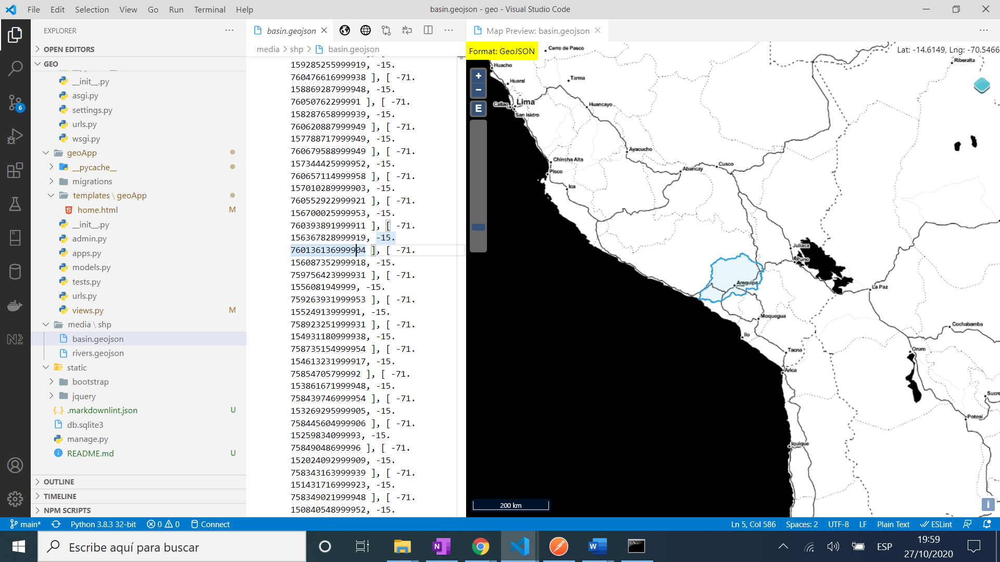

# :zap: Python Django Folium

* Python-Django app using the Folium maps library to display a part of the world with geo features highlighted. This uses code from  [Hatari Labs, Developing geospatial webapps with Python and Django - Tutorial](https://www.youtube.com/watch?v=sdhiVtDw-GA)

## :page_facing_up: Table of contents

* [:zap: Python Django Folium](#zap-python-django-folium)
	* [:page_facing_up: Table of contents](#page_facing_up-table-of-contents)
	* [:books: General info](#books-general-info)
	* [:camera: Screenshots](#camera-screenshots)
	* [:signal_strength: Technologies](#signal_strength-technologies)
	* [:floppy_disk: Setup](#floppy_disk-setup)
	* [:computer: Code Examples](#computer-code-examples)
	* [:cool: Features](#cool-features)
	* [:clipboard: Status & To-do list](#clipboard-status--to-do-list)
	* [:clap: Inspiration](#clap-inspiration)
	* [:envelope: Contact](#envelope-contact)

## :books: General info

* Django framework: used to show hydrological spatial information on a webapp

## :camera: Screenshots




## :signal_strength: Technologies

* [Python v3](https://www.python.org/) programming language
* [Django v3](https://www.djangoproject.com/) web framework
* [Python library Folium v0.11.0](https://pypi.org/project/folium/) used with the Python ecosystem and the mapping strengths of the Leaflet.js library.
* [VS Code extension, Geo Data Viewer](https://marketplace.visualstudio.com/items?itemName=RandomFractalsInc.geo-data-viewer) to view geo data maps (see screen shot).
* [GeoJSON](https://geojson.org/) format for encoding geographic data structures.

## :floppy_disk: Setup

* [Install Python](https://docs.python-guide.org/starting/installation/)
* [Install pip](https://docs.python-guide.org/dev/virtualenvs/#installing-pipenv)
* [Install Django](https://docs.djangoproject.com/en/3.1/howto/windows/) by typing `pip install Django`
* [Install Folium](https://pypi.org/project/folium/) by typing `pip install folium`
* Run `django-admin startproject mysite` to create a new project [ref. docs](https://docs.djangoproject.com/en/3.1/intro/tutorial01/)
* Add code
* Run `python manage.py runserver` to run server on port 8000

## :computer: Code Examples

* extract from `geoApp/views.py` to add basin & river features to part of a map of Peru

```python
## add to view
  folium.GeoJson(os.path.join(shp_dir,'basin.geojson'),name='basin',style_function=lambda x:style_basin).add_to(m)
  folium.GeoJson(os.path.join(shp_dir,'rivers.geojson'),name='rivers',style_function=lambda x:style_river).add_to(m)
  folium.LayerControl().add_to(m)
```

## :cool: Features

* Uses geojson files that can be viewed in VS Code using [VS Code extension, Geo Data Viewer](https://marketplace.visualstudio.com/items?itemName=RandomFractalsInc.geo-data-viewer)

## :clipboard: Status & To-do list

* Status: Working
* To-do: Change geojson files & coords to show new locations. Develop html into a multipage website

## :clap: Inspiration

* [Hatari Labs, Developing geospatial webapps with Python and Django - Tutorial](https://www.youtube.com/watch?v=sdhiVtDw-GA)
* [Hatari Labs Blog: Django REST Framework Course for Beginners](https://www.hatarilabs.com/ih-en/developing-geospatial-webapps-with-python-and-django-tutorial)

## :envelope: Contact

* Repo created by [ABateman](https://www.andrewbateman.org) - you are welcome to [send me a message](https://andrewbateman.org/contact)
